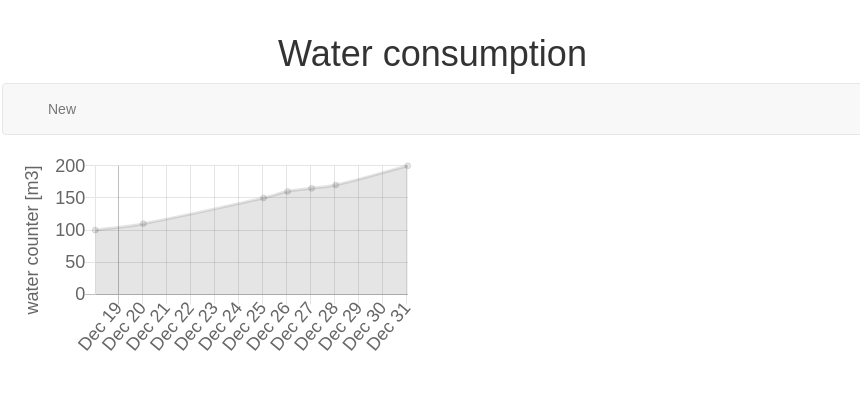

`waterConsumption` is a web based application to monitor your water consumption.

# Features

- visualize your water consumption over time
- add a new reading as indicated from your water meter
- edit a reading

# Screenshots



# From a technical POV

This project has a server/client architecture.

The backend is simple: a REST API, data stored in a plain csv file.

The frontend is currently simple just html, javascript. No use of a framework yet, but as the project grows and more features are needed, I think it will be easier to flip to react.js

# Requirements

- nodejs

# Installation

Install the dependencies of the project:

```
npm install
```

You can start the server with:

```
node ./server.js
```

With your browser, type the following in the address bar:

```
http://localhost:1234/public/index.html
```
